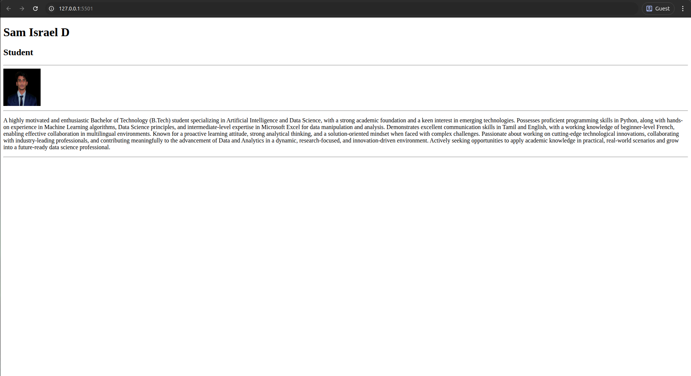

# Profile Page
## Date: 07/07/2025
## Objective:

To design a simple Profile Page using HTML that displays a user's profile image, name, headings, and a short bio, suitable for personal or academic purposes.

## Tasks:

#### 1. Set Up the HTML Structure:

Use ```<!DOCTYPE html>```, ```<html>```, ```<head>```, and ```<body>``` tags to define the basic structure.

Add an appropriate ```<title>``` such as "My Profile".

#### 2. Add Page Headings:

Insert a main heading using ```<h1>``` for the user's name.

Include subheadings such as ```<h2>``` or ```<h3>``` for titles or roles (e.g., "Student", "Web Developer").

#### 3. Insert a Profile Image:

Use the `````` tag to display the user’s profile picture.

Add alt text and set basic attributes like width and height.

#### 4. Include a Short Bio Section:

Add a paragraph using ```<p>``` to provide a short introduction or biography.

The content may include education, interests, or a personal statement.

#### 5. Organize Content Using HTML Elements:

Use ```<section>```, ```<div>```, or ```<article>``` for logical grouping.

Add a horizontal line (```<hr>```) to separate sections.

#### 6. Keep the Design HTML-Only:

Do not use CSS or JavaScript.

Focus on semantic HTML and readability.
## HTML Code:
```html
<!DOCTYPE html>
<html lang="en">
  <head>
    <meta charset="UTF-8" />
    <meta name="viewport" content="width=device-width, initial-scale=1.0" />
    <title>My Profile</title>
  </head>
  <body>
    <div>
      <h1>Sam Israel D</h1>
      <h2>Student</h2>
    </div>
    <hr />
    <div>
      
    </div>
    <hr />
    <section>
      <p>
        A highly motivated and enthusiastic Bachelor of Technology (B.Tech)
        student specializing in Artificial Intelligence and Data Science, with a
        strong academic foundation and a keen interest in emerging technologies.
        Possesses proficient programming skills in Python, along with hands-on
        experience in Machine Learning algorithms, Data Science principles, and
        intermediate-level expertise in Microsoft Excel for data manipulation
        and analysis. Demonstrates excellent communication skills in Tamil and
        English, with a working knowledge of beginner-level French, enabling
        effective collaboration in multilingual environments. Known for a
        proactive learning attitude, strong analytical thinking, and a
        solution-oriented mindset when faced with complex challenges. Passionate
        about working on cutting-edge technological innovations, collaborating
        with industry-leading professionals, and contributing meaningfully to
        the advancement of Data and Analytics in a dynamic, research-focused,
        and innovation-driven environment. Actively seeking opportunities to
        apply academic knowledge in practical, real-world scenarios and grow
        into a future-ready data science professional.
      </p>
    </section>
    <hr />
  </body>
</html>


```
## Output:

## Result:
A simple Profile Page using HTML that displays a user's profile image, name, headings, and a short bio, suitable for personal or academic purposes is designed successfully.
